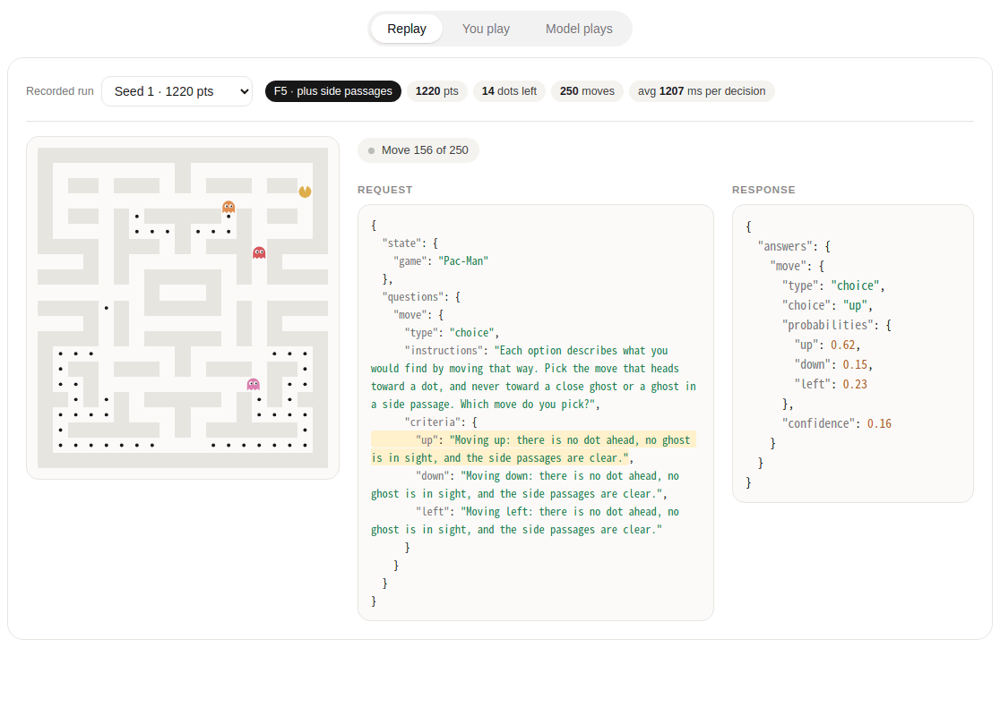

English | [简体中文](README.zh-CN.md)

# Pac-Man, played by a decision model

An open-source reproduction of the Pac-Man demo in Ollama's post
[**Ollama now supports Jev-style decision models**](https://ollama.com/blog/ollama-now-supports-jev-style-decision-models):
at every move the game asks a local model **one typed question** (`/v1/systemone`, a `choice` over the legal
directions) and plays the answer.

The post shows the result (a recorded game, 91 ms per decision) but not the request the model was given. This repo
rebuilds the game, the loop and the request formats from scratch, and measures how much the way you describe the
board changes how well the model plays.

**Write-up (on Substack):** [Reproducing Ollama's Pac-Man decision-model demo](https://kevinyuan1.substack.com/p/reproducing-ollamas-pac-man-decision)



> **Independent project.** Not affiliated with or endorsed by Ollama. The maze layout and the look of the page follow
> the demo in the post; the engine, the request formats and all code here are new. Pac-Man is a trademark of
> Bandai Namco Entertainment; this is an unaffiliated educational clone.

## Try it

Everything runs in the browser. There is nothing to deploy.

```bash
python3 -m http.server -d web 8765      # then open http://localhost:8765/
python3 tools/build_single.py           # or build one self-contained dist/pacman.html
```

The page has three tabs:

| Tab | What it does |
|---|---|
| **Replay** | Replays recorded runs. Pick a run (grouped by how the board was described) and read, for every move, the **request** sent to the model beside the **response**. The option the model chose is highlighted. |
| **You play** | The same game with the keyboard (arrows / WASD) or touch. |
| **Model plays** | A model drives. Enter your own endpoint, model name and request format; each move is a live request you can read. |

### Live mode

You need [Ollama](https://ollama.com) 0.35 or newer and a decision model:

```bash
ollama pull nimble
```

Open the **Model plays** tab, keep `http://localhost:11434`, press *Test connection*, then *Start*.

Browsers enforce CORS, and Ollama only accepts pages served from `http://localhost` by default. If you open the
single file straight from disk (the browser then sends `Origin: null`) or host the page on another domain, start
Ollama with `OLLAMA_ORIGINS` set, for example `OLLAMA_ORIGINS="*" ollama serve`. The page's *Connection help*
has the macOS and systemd variants. A page served over https can only call an https endpoint or localhost.

### Python

```bash
python3 -m pacman.run --agent bfs --seed 1 --log web/game.json        # baseline, no model
python3 -m pacman.run --agent nimble --fmt rays-side --seed 1 \
        --base-url http://localhost:11434 --log web/my_run.json         # a model plays, requests are logged
python3 -m pacman.probe -n 5                                            # connectivity and latency check
python3 tools/make_runs.py                                              # refresh web/runs.json for the replay picker
```

## What is in here

| Path | |
|---|---|
| `pacman/` | Headless engine (`game.py`), baselines (`agents.py`), the Nimble agent and every request format (`nimble.py`), the runner |
| `web/` | The page. `game.js` is the engine port, `prompts.js` the request builders, plus recorded runs (`*.json`) |
| `tools/` | Offline evaluation, failure analysis, capability probes, run-list and single-file builders |
| `tests/` | Engine and request-format tests. `test_prompts_parity.py` checks that the JavaScript and Python builders produce identical requests (932 across 233 states) |
| `experiments.md` | The lab notebook: every attempt, what was measured and what it showed (written in Chinese) |

```bash
python3 -m unittest discover -s tests   # the web tests need node and are skipped without it
```

## What the experiments showed

Score is +10 per dot and −50 per catch, three lives. Model rows are three games each (seeds 1–3), so treat them as
rough; the rule rows are 20+ games each. All runs use `nimble` through Ollama 0.35 on a laptop, roughly 1.2 s per
decision.

| What the model is given | Mean score |
|---|---|
| the whole board as a character matrix | −80 |
| a 7×7 window plus per-direction distances | 890 (1 game) |
| per direction: word fragments (`dot, no ghost`) | 553 |
| per direction: full sentences, straight-line view | 587 |
| … plus "a ghost is in a side passage next to that cell" | **1020** |
| … plus "the nearest dot is toward / not toward that way" | 937 |
| BFS-computed labels (`DEADLY`, `nearest dot N steps`) | 713 |
| *no model:* random / a hand-written rule on the sentence facts / BFS | 63 / 1172 / 1384 |

- **The model does not read the board for you.** In offline checks a raw matrix or raw coordinates are close to
  chance. It handles one target described in plain words well, and falls apart when it has to pick the nearest of
  several.
- **Wording matters a lot.** The same facts as fragments or as sentences moved agreement with BFS from 65 % to
  83 % (offline, 60 positions), and a closing question helps a little.
- **Missing information, not the model, caused the early losses.** In the sentence version, 6 of the 9 catches
  were a ghost the model could not see (the other 3 were unavoidable). Adding one fact, "a ghost is in a side
  passage next to that cell", removed those and lifted the mean score from 587 to 1020.
- **A rule on the same facts does at least as well.** This repo is a study of how to describe a situation to a
  decision model, not evidence that a model beats a few lines of code on Pac-Man.

All of these are lower bounds for "what the model can do": a better prompt can change the picture, and several
variants share one maze and ghost behaviour that are ours, not the post's. The post's own recorded game, scored with
the rules here, comes to about 1180, but its ghosts move differently, so the numbers are not comparable.

## Credits

- [Ollama](https://ollama.com), for the post that this reproduces, and for the decision-model API it describes.
- The `nimble` decision model by Bespoke Labs, as named in the post.

## License

[MIT](LICENSE). The license covers the code and the recorded runs in this repository; "Ollama", "Nimble" and "Pac-Man" belong to their respective owners (see the note at the top).
