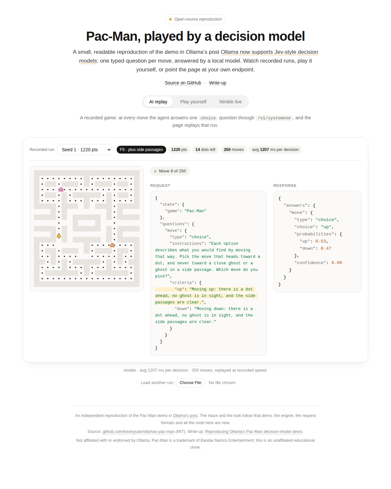

[English](README.md) | 简体中文

# 让决策模型玩 Pac-Man

这是对 Ollama 博客文章 [Ollama now supports Jev-style decision models](https://ollama.com/blog/ollama-now-supports-jev-style-decision-models)
里 Pac-Man 演示的**开源复现**：每走一步，游戏向本地模型提出一个带类型的问题（`/v1/systemone` 的 `choice`，
选项是当前合法的方向），再按模型的回答走棋。

文章展示了结果（一局录像，每次决策 91 ms），但没有公开发给模型的请求内容。本仓库从零实现了游戏、决策循环和
多种请求写法，并测量"怎么向模型描述棋盘"对它玩得好坏的影响。

**文章（发布在 Substack）：** [Reproducing Ollama's Pac-Man decision-model demo](https://kevinyuan1.substack.com/p/reproducing-ollamas-pac-man-decision)



> **独立项目**，与 Ollama 无隶属关系，也未获其认可。迷宫布局和页面外观参照了文章里的演示；引擎、请求格式和全部代码都是新写的。
> Pac-Man 是 Bandai Namco 的商标，本项目只是非官方的教学性克隆。

## 使用

全部在浏览器里运行，不需要部署服务端：

```bash
python3 -m http.server -d web 8765     # 打开 http://localhost:8765/
python3 tools/build_single.py          # 或生成单文件 dist/pacman.html
```

页面三个标签：**AI replay**（回放录好的对局，并排看每一步的请求和回答）、**Play yourself**（自己玩）、
**Nimble live**（填入自己的 Ollama 地址，让模型实时玩，每一步的请求都能看到）。

实时模式需要 Ollama 0.35 或更新版本和决策模型（`ollama pull nimble`）。浏览器有跨域限制，Ollama 默认只接受
`http://localhost` 页面；直接双击打开 html 文件或托管在别的域名时，需要设置 `OLLAMA_ORIGINS`
（如 `OLLAMA_ORIGINS="*" ollama serve`），页面里的 *Connection help* 有详细说明。

## 主要发现（详见英文 README 与 `experiments.md`）

计分：吃豆 +10，被抓 −50，3 条命。模型每种写法跑 3 局，只能当粗略参考。

| 给模型的信息 | 均分 |
|---|---|
| 整张字符矩阵 | −80 |
| 逐方向的单词碎片 | 553 |
| 逐方向的完整句子（直线视野） | 587 |
| ……再加"目标格旁的岔路里有幽灵" | **1020** |
| BFS 算好的标签（带答案） | 713 |
| 无模型：随机 / 同样事实的手写规则 / BFS | 63 / 1172 / 1384 |

- 模型不会替你"读"棋盘：原始矩阵、原始坐标接近随机。
- 写法影响很大：同样的信息，从碎片改成句子，离线与 BFS 的一致率从 65% 升到 83%。
- 早期失分主要是**输入里缺了信息**：补上"侧向岔路里有幽灵"一个事实，均分从 587 提到 1020。
- 同样的事实，一条手写规则不比模型差：这是一份"如何向决策模型描述局面"的研究，不能说明模型在 Pac-Man 上优于几行代码。

以上都只是"在试过的写法下"的下限，换更好的提示词结果可能不同。

## 许可

[MIT](LICENSE)。许可范围是本仓库的代码和录制的对局；"Ollama"、"Nimble"、"Pac-Man" 归各自所有者（见开头声明）。
